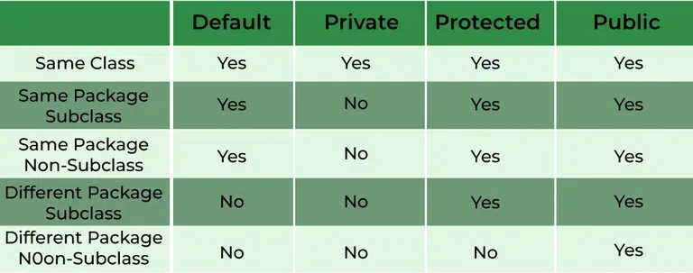

# NOTES for 21st August

## Inheritance

* __Inheritance__  is an ability of a _Class_ to `extend` another _Class_ in Java. This means that any __public__ and __protected__ members of the _parent_ class are `inherited` into the _child_ class.

* This means that all inherited members from the _parent_ class may also be used by an object of the _child_ class.

* There are different use cases depending on the usage of `static`, `final`, `abstract` (specifiers) for the classes, and `public`, `private`, `default` and `protected` (access modifiers) for both members and classes.

* If you get asked in an interview, then Java __does not__ support _Multiple_ inheritance (aka child class inheriting from more than one parent classes). _Multilevel_ inheritance is allowed (aka a chain of inheriting, like A->B->C). However, Java does subtly allow multiple inheritance based on behavior (post Java 8).

* If the names of 2 (non-static) inherited members (variables/methods) are the _same_, then by default, the function being called depends on the object. By default, the function called will be that held by the class to which the object belongs. For methods, this is called __method overriding__, and here, the methods may share the same _function signature_, which is not allowed in __method overloading__.

* The __super()__ function calls the constructor of the parent class (aka the class the child extends from).

* Table to show how access modifiers affect inheritance:

* There are 3 cases where a __private constructor__ is acceptable: either the main method belongs to the same class (and can hence locate the constructor), or we are creating a __Singleton object blueprint__ (use case: DAO model), or we use a public constructor to delegate among a set of private constructors.

* __static__ member methods of a class can be called directly (aka without creating an object of the class), using the format `className.method()`. This logic is used for Singleton classes.